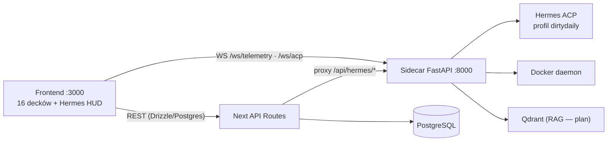

<<<<<<< HEAD
# DirtyNest

Frontend-only cyberpunk command center UI built with Next.js 16, React 19, TypeScript, and Tailwind v4.

## What remains in this repo
=======
# 🦅 DirtyNest — Taktyczne Centrum Dowodzenia v0.03

> Cyberpunkowy kokpit dewelopera, hub badań AI, orchestrator wieloagentowego roju (Hermes) i macierz obserwowalności systemu.

**Stack:** Next.js 16 (App Router + Turbopack) · React 19 · TypeScript · Tailwind CSS v4 · Zustand · **PostgreSQL + Drizzle ORM** · **Sidecar FastAPI (Python)** — integracja **Hermes ACP**, Docker, CDP, telemetria.

> **Status projektu:** frontend (16 decków) działa; backend jest w budowie — trwa migracja `sql.js → PostgreSQL/Drizzle` i wdrażanie architektury agentowej. Aktualny audyt: [docs/current-state.md](./docs/current-state.md) · Plan: [docs/implementation-plan.md](./docs/implementation-plan.md).
>>>>>>> 29c61f5ff3ec86ceaa460801926554e8eed63f24

- SPA shell in `src/app/page.tsx`
- deck views in `src/components/views/`
- client-side Zustand stores in `src/stores/`
- frontend utilities in `src/lib/`
- local browser persistence for settings, API keys, logs, and simulated agent state

Backend code, API routes, database layers, sidecar services, and backend infrastructure files have been removed.

## Development

### Tryb deweloperski (bez Dockera)

```bash
<<<<<<< HEAD
npm install
npm run dev
```

Open `http://localhost:3000`.

## Validation

```bash
npm run typecheck
npm run lint
npm test
npm run build
```

## Notes

- Some decks still contain mock/demo datasets by design.
- Agent, Docker, knowledge, social, and Zbiornik flows now run in frontend-only fallback mode.
- API-key settings are stored locally in browser storage.
=======
# 1. Zależności
npm install

# 2. Baza PostgreSQL (lub własny DATABASE_URL w .env.local)
docker compose up -d postgres

# 3. Sidecar (opcjonalnie — telemetria, Hermes ACP, Docker, automations)
cd sidecar
python -m venv .venv
.venv/Scripts/pip install -r requirements.txt   # Windows; na *nix: .venv/bin/pip
.venv/Scripts/uvicorn main:app --port 8000
cd ..

# 4. Frontend
npm run dev
```

Otwórz [http://localhost:3000](http://localhost:3000) · Sidecar API: [http://localhost:8000/docs](http://localhost:8000/docs)

### Pełny homelab (Docker Compose)

```bash
cp .env.example .env    # uzupełnij sekrety (patrz .env.example)
docker compose up -d --build
```

Usługi: `web` (:3000) · `sidecar` (:8000) · `postgres` (:5432) — docelowo także `qdrant`, `redis`, `searxng`, `ollama` (faza F1 planu).

---

## 🏗️ Architektura (skrót)



Wszystkie czaty są obsługiwane przez **wyspecjalizowanych agentów Hermes** (ACP): routing prompt → agent → pętla ReAct → strumień zdarzeń do Control Room, z bramką **HITL** dla operacji krytycznych. Szczegóły: [docs/agent-system.md](./docs/agent-system.md).

---

## 📖 Dokumentacja

| Dokument | Zawartość |
|---|---|
| [docs/current-state.md](./docs/current-state.md) | **Audyt stanu** — co działa, co jest mockiem, czego brakuje |
| [docs/overview.md](./docs/overview.md) | Przegląd projektu i architektury |
| [docs/backend-architecture.md](./docs/backend-architecture.md) | Topologia backendu (Next + sidecar + Hermes) |
| [docs/api-specification.md](./docs/api-specification.md) | Katalog API: istniejące i planowane endpointy |
| [docs/agent-system.md](./docs/agent-system.md) | Agenci Hermes, orchestrator, HITL |
| [docs/data-models.md](./docs/data-models.md) | Schemat bazy (istniejący + docelowy, ERD) |
| [docs/decisions.md](./docs/decisions.md) | Rejestr decyzji architektonicznych (ADR) |
| [docs/implementation-plan.md](./docs/implementation-plan.md) | **Szczegółowy plan implementacji F0–F6** |
| [docs/zbiornik-ops.md](./docs/zbiornik-ops.md) | Zbiornik Ops — kontrakt operacyjny (runner, kolejka HITL, API, discovery) |
| [DOCUMENTATION.md](./DOCUMENTATION.md) | Legacy: szczegółowy przewodnik frontendu (EN) |
| [SYSTEM_SCAN_REPORT.md](./SYSTEM_SCAN_REPORT.md) · [HERMES_ECOSYSTEM_REPORT.md](./HERMES_ECOSYSTEM_REPORT.md) | Raporty operacyjne hosta |

---

## 🎛️ Workspaces (16 decków)

| Deck | Opis |
|---|---|
| 🛰️ **Overview** | 32+ widżetów bento, presety układów, drag & drop |
| 🧠 **Neural Chatbot (Hermes)** | czat wielomodelowy, parser XML tool-call, trace rozumowania |
| 🎛️ **Control Room** | kokpit AI, strumień myśli, bramki HITL |
| 🤖 **AI Agents Swarm** | miniony, DAG zadań, metryki CPU/RAM |
| 📚 **Knowledge Vault** | graf wiedzy 2D/3D, Markdown, skills (backend RAG — plan) |
| 🐳 **Docker Hub** | cykl życia kontenerów, logi, Compose |
| 🎨 **Image & Sound Studios** | studio obrazu; syntezator Web Audio |
| 👤 **Persona Nexus** | awatar z syntezą mowy i wizemami |
| 🌐 **Social Media Command** | multi-network scheduler (backend — plan F5) |
| 🌊 **Zbiornik Ops** | nadzorowana automatyzacja zbiornik.com (jeden login, kolejka HITL, limity) — [docs/zbiornik-ops.md](./docs/zbiornik-ops.md) |
| 🛡️ **Threat Intel** | radar CVE, feed alertów |
| 📅 **Operations Schedule** | kalendarz operacyjny, cron |
| 💓 **API Health** | proby endpointów i usług ekosystemu |
| 🛠️ **Dev Tools Suite** | 15+ narzędzi klienckich (Diff, JWT, palety, cron…) |
| 📊 **Hardware Stats** | telemetria hosta (sidecar), Prometheus-style |
| 🗒️ **System Logs** | konsola na żywo, audyt, eksporty |
| ⚙️ **Settings** | konfiguracja decków, klucze API, motywy |

---

## 🔒 Bezpieczeństwo

- Sekrety **tylko** w `.env.local` (wzorzec: `.env.example`); nie commitujemy kluczy ani haseł.
- Hasło bazy podawane przez `${POSTGRES_PASSWORD}` w `docker-compose.yml` — faza F0 planu usuwa domyślną wartość z repo.
- Operacje krytyczne (publikacja social, Docker, shell) przechodzą przez bramkę **HITL** w Control Room.
- Docelowo: JWT (2 konta operatorów), szyfrowane klucze LLM/social w bazie (faza F2).

## 🧰 Skrypty

```bash
npm run dev          # serwer deweloperski (Turbopack)
npm run build        # build produkcyjny + typecheck
npm run lint         # ESLint
npm run typecheck    # tsc --noEmit
```

## 🗺️ Mapa drogowa

Fazy F0–F6 (migracja danych → infrastruktura → auth → Hermes Engine → RAG → social → jakość): **[docs/implementation-plan.md](./docs/implementation-plan.md)**.
>>>>>>> 29c61f5ff3ec86ceaa460801926554e8eed63f24
