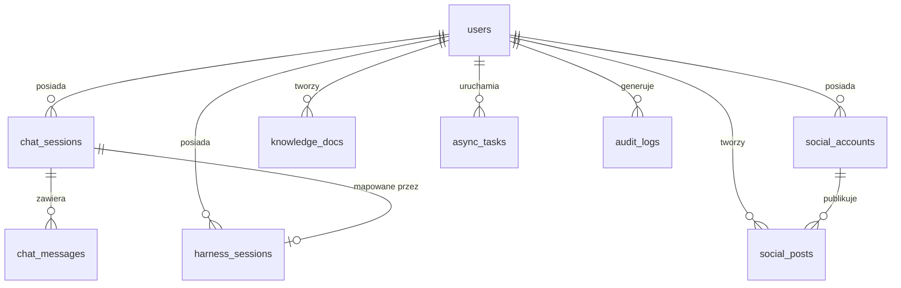

# DirtyNest 2.0 — Model danych (PostgreSQL 16 + Qdrant)

> Zmiana względem 1.x: embeddingi i wyszukiwanie wektorowe przeniesione z pgvector do
> **Qdrant**; w PostgreSQL zostają metadane (`knowledge_docs.qdrant_point_id`).
> Nowe tabele: `harness_sessions` (mapowanie sesji Harness), `async_tasks` (BullMQ).
> Usunięte: `agents_hermes`, `agent_executions` (rejestr agentów → profil Harness),
> `knowledge_graph_edges` (relacje semantyczne liczone w Qdrancie/metadanych).

## 1. Diagram ERD



## 2. Tabele

### users
```sql
CREATE TABLE users (
  id UUID PRIMARY KEY DEFAULT gen_random_uuid(),
  email VARCHAR(255) UNIQUE NOT NULL,
  password_hash VARCHAR(255) NOT NULL,
  display_name VARCHAR(100),
  role VARCHAR(20) NOT NULL DEFAULT 'member', -- admin | member
  settings JSONB DEFAULT '{}',
  created_at TIMESTAMPTZ DEFAULT now(),
  updated_at TIMESTAMPTZ DEFAULT now()
);
```

### chat_sessions / chat_messages
```sql
CREATE TABLE chat_sessions (
  id UUID PRIMARY KEY DEFAULT gen_random_uuid(),
  user_id UUID REFERENCES users(id) ON DELETE CASCADE,
  title VARCHAR(255) NOT NULL,
  model VARCHAR(50),
  mode VARCHAR(50),                          -- standard | reasoning | deep_research | code_interpreter
  harness_session_id VARCHAR(100),           -- mapowanie do sesji Harness
  created_at TIMESTAMPTZ DEFAULT now(),
  updated_at TIMESTAMPTZ DEFAULT now()
);

CREATE TABLE chat_messages (
  id UUID PRIMARY KEY DEFAULT gen_random_uuid(),
  session_id UUID REFERENCES chat_sessions(id) ON DELETE CASCADE,
  sender VARCHAR(20) NOT NULL,               -- user | ai | system
  text TEXT NOT NULL,
  tokens INTEGER DEFAULT 0,
  thinking_time_ms INTEGER DEFAULT 0,
  thinking_trace JSONB DEFAULT '[]',
  citations JSONB DEFAULT '[]',
  tool_calls JSONB DEFAULT '[]',
  agent_used VARCHAR(50),
  created_at TIMESTAMPTZ DEFAULT now()
);
```

### social_accounts / social_posts
```sql
CREATE TABLE social_accounts (
  id UUID PRIMARY KEY DEFAULT gen_random_uuid(),
  user_id UUID REFERENCES users(id) ON DELETE CASCADE,
  platform VARCHAR(20) NOT NULL,             -- twitter | instagram | facebook | tiktok | reddit
  account_name VARCHAR(255) NOT NULL,
  access_token TEXT NOT NULL,                -- szyfrowane AES-256-GCM
  refresh_token TEXT,
  expires_at TIMESTAMPTZ,
  is_active BOOLEAN DEFAULT TRUE,
  created_at TIMESTAMPTZ DEFAULT now(),
  updated_at TIMESTAMPTZ DEFAULT now()
);

CREATE TABLE social_posts (
  id UUID PRIMARY KEY DEFAULT gen_random_uuid(),
  user_id UUID REFERENCES users(id) ON DELETE CASCADE,
  account_id UUID REFERENCES social_accounts(id) ON DELETE SET NULL,
  platform VARCHAR(20) NOT NULL,
  text TEXT NOT NULL,
  media_urls TEXT[] DEFAULT '{}',
  status VARCHAR(20) DEFAULT 'draft',        -- draft | scheduled | queued | published | failed
  scheduled_time TIMESTAMPTZ,
  cron_expression TEXT,
  repeat_until TIMESTAMPTZ,
  published_time TIMESTAMPTZ,
  platform_post_id VARCHAR(255),
  metrics JSONB DEFAULT '{}',
  error TEXT,
  created_at TIMESTAMPTZ DEFAULT now(),
  updated_at TIMESTAMPTZ DEFAULT now()
);
```

### knowledge_docs (metadane; embeddingi w Qdrant)
```sql
CREATE TABLE knowledge_docs (
  id UUID PRIMARY KEY DEFAULT gen_random_uuid(),
  user_id UUID REFERENCES users(id) ON DELETE CASCADE,
  title VARCHAR(255) NOT NULL,
  content TEXT NOT NULL,
  tags TEXT[] DEFAULT '{}',
  metadata JSONB DEFAULT '{}',
  qdrant_point_id UUID,                      -- powiązanie z wektorem w Qdrant
  created_at TIMESTAMPTZ DEFAULT now(),
  updated_at TIMESTAMPTZ DEFAULT now()
);
```

### docker_containers / compose_stacks
```sql
CREATE TABLE docker_containers (
  id UUID PRIMARY KEY DEFAULT gen_random_uuid(),
  container_id VARCHAR(100) UNIQUE NOT NULL,
  name VARCHAR(255) NOT NULL,
  image VARCHAR(255) NOT NULL,
  status VARCHAR(20) NOT NULL,               -- running | stopped | restarting
  ports TEXT,
  cpu_percent FLOAT DEFAULT 0,
  memory_usage VARCHAR(50),
  net_io VARCHAR(50),
  uptime VARCHAR(50),
  stack VARCHAR(100),
  last_updated TIMESTAMPTZ DEFAULT now()
);

CREATE TABLE compose_stacks (
  id UUID PRIMARY KEY DEFAULT gen_random_uuid(),
  user_id UUID REFERENCES users(id) ON DELETE CASCADE,
  name VARCHAR(100) NOT NULL,
  services_count INTEGER DEFAULT 0,
  status VARCHAR(20) DEFAULT 'active',       -- active | degraded | inactive
  path TEXT,
  services TEXT[] DEFAULT '{}',
  yaml_content TEXT NOT NULL,
  created_at TIMESTAMPTZ DEFAULT now(),
  updated_at TIMESTAMPTZ DEFAULT now()
);
```

### async_tasks (BullMQ — persystencja stanu)
```sql
CREATE TABLE async_tasks (
  id UUID PRIMARY KEY DEFAULT gen_random_uuid(),
  user_id UUID REFERENCES users(id) ON DELETE CASCADE,
  type VARCHAR(50) NOT NULL,                 -- deep_research | social_publish | cve_scan | container_scan
  status VARCHAR(20) DEFAULT 'pending',      -- pending | processing | completed | failed | cancelled
  payload JSONB DEFAULT '{}',
  result JSONB,
  error TEXT,
  progress FLOAT DEFAULT 0,
  created_at TIMESTAMPTZ DEFAULT now(),
  started_at TIMESTAMPTZ,
  completed_at TIMESTAMPTZ
);
```

### audit_logs
```sql
CREATE TABLE audit_logs (
  id UUID PRIMARY KEY DEFAULT gen_random_uuid(),
  user_id UUID REFERENCES users(id) ON DELETE SET NULL,
  level VARCHAR(10) NOT NULL,                -- INFO | WARN | ERROR | SUCCESS
  source VARCHAR(50) NOT NULL,               -- UI | DATABASE | AGENT | DOCKER | SOCIAL | SYSTEM | API
  action VARCHAR(100) NOT NULL,
  operator VARCHAR(100),
  details JSONB DEFAULT '{}',
  ip_address INET,
  user_agent TEXT,
  created_at TIMESTAMPTZ DEFAULT now()
);
```

### harness_sessions (persystencja sesji Harness)
```sql
CREATE TABLE harness_sessions (
  id UUID PRIMARY KEY DEFAULT gen_random_uuid(),
  session_id VARCHAR(255) UNIQUE NOT NULL,   -- ID sesji z Harness
  user_id UUID REFERENCES users(id) ON DELETE CASCADE,
  state JSONB DEFAULT '{}',                  -- stan sesji Harness
  created_at TIMESTAMPTZ DEFAULT now(),
  updated_at TIMESTAMPTZ DEFAULT now(),
  expires_at TIMESTAMPTZ                     -- TTL 7 dni (profil Harness)
);
```

## 3. Podsumowanie (11 tabel)

| Tabela | Opis |
|---|---|
| `users` | Operatorzy (admin/member) |
| `chat_sessions` | Sesje czatu z mapowaniem `harness_session_id` |
| `chat_messages` | Wiadomości + thinking_trace + tool_calls (audyt) |
| `social_accounts` | Konta SM z zaszyfrowanymi tokenami |
| `social_posts` | Posty, harmonogramy (cron), metryki |
| `knowledge_docs` | Metadane dokumentów (treść + wektor w Qdrant) |
| `docker_containers` | Cache stanu kontenerów |
| `compose_stacks` | Stosy Docker Compose |
| `async_tasks` | Zadania BullMQ (status, postęp, wynik) |
| `audit_logs` | Logi audytowe (7 źródeł) |
| `harness_sessions` | Mapowanie sesji Harness → użytkownik (TTL 7 dni) |

## 4. Qdrant (warstwa wektorowa)

- Kolekcja: `knowledge_vault` (wymiar wg modelu embeddingowego, dystans cosine).
- Jeden punkt na dokument: `payload = { doc_id, user_id, title, tags, category }`.
- Zapis/odczyt tylko przez serwis backendu (`knowledge.service`) — agenci wołają
  narzędzie `dirtynest_semantic_search`, nie Qdrant bezpośrednio.
- Migracja pgvector → Qdrant: przy pierwszym ingestcie (pole `qdrant_point_id` w `knowledge_docs`).

## 5. Indeksy i zasady

- `chat_sessions(user_id)`, `chat_messages(session_id, created_at)` — btree.
- `social_posts` partial index `WHERE status IN ('scheduled','queued')` — skan harmonogramu.
- `async_tasks(status, type)` — widoki kolejek.
- Sekrety w JSONB/tokenach: wyłącznie zaszyfrowane (AES-256-GCM, klucz `ENCRYPTION_KEY`).