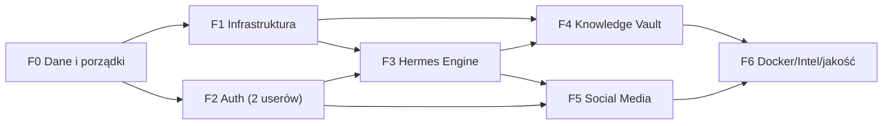

# DirtyNest — Szczegółowy plan implementacji (F0–F6)

> **Wersja:** 1.0 · **Data:** 2026-08-27
> **Punkt wyjścia:** audyt [current-state.md](./current-state.md) · **Decyzje:** [decisions.md](./decisions.md)
>
> Zasada fazowania: **najpierw domykamy to, co niedokończone (F0–F1), potem budujemy nowe warstwy (F2–F6)** — zgodnie z wyborem użytkownika. Każda faza ma: cel, zadania (z plikami), deliverables, kryteria akceptacji i ryzyka. Zadania w fazie można realizować równolegle, fazy — sekwencyjnie (wyjątki oznaczone).

---

## 0. Legenda i reguły wspólne

- ✅ = kryterium akceptacji fazy (definition of done).
- **Reguła 1 — migracje zamiast runtime-DDL:** od F0 schemat zmienia się wyłącznie przez `drizzle-kit generate` → `drizzle/*.sql`; `CREATE TABLE IF NOT EXISTS` w `src/db/index.ts` zostaje usunięte.
- **Reguła 2 — audyt każdej mutacji:** dispatcher `src/lib/logger.ts` → `system_logs` (a od F6 `audit_logs`).
- **Reguła 3 — sekrety tylko w env:** nic w kodzie, docker-compose ani dokumentacji (F0 usuwa istniejące wycieki).
- **Reguła 4 — jeden protokół agentów (ACP):** nie wprowadzamy równoległych mechanizmów agentowych (ADR-02, ADR-07).
- **Reguła 5 — testy towarzyszą fazom:** każda faza dostarcza testy tego, co buduje (min. happy path + 1 negatywny przypadek).

---

## F0 — Domknięcie warstwy danych i porządki (priorytet najwyższy)

**Cel:** spójny, powtarzalny schemat PostgreSQL pod Drizzle; likwidacja długu, który blokuje wszystkie kolejne fazy.

| # | Zadanie | Pliki | Uwagi |
|---|---|---|---|
| 0.1 | Regeneracja migracji dla PostgreSQL (usunięcie starej `0000_young_shiver_man.sql` w dialekcie SQLite; pełny baseline: 10 tabel z `schema.ts`) | `drizzle/`, `drizzle.config.ts` | `npx drizzle-kit generate`; baseline obejmuje `hermes_*` i `system_logs` |
| 0.2 | Usunięcie runtime-DDL z `initDb()`; `initDb` zostaje jako „ensure migrations applied" (np. `drizzle-kit migrate` w starcie sidecara/web) | `src/db/index.ts` | dwie prawdy o schemacie → jedna |
| 0.3 | Migracja danych sql.js → PostgreSQL (uruchomienie i weryfikacja istniejącego skryptu) | `sidecar/migrate_sqlite_to_pg.py` | dane z localStorage/sql.js użytkowników — instrukcja w README |
| 0.4 | Usunięcie zależności `sql.js` | `package.json` | sprawdź brak importów (`grep "sql.js" src/`) |
| 0.5 | Sekrety → env: usunięcie hasła z `docker-compose.yml`, `src/db/index.ts`, `drizzle.config.ts`; `POSTGRES_PASSWORD` tylko z `.env`; utworzenie `.env.example` | wymienione pliki | **rotacja** obecnego hasła (było w repo) |
| 0.6 | Typy dat: `varchar(100)` → `timestamptz` w `schema.ts` + migracja konwersji | `src/lib/schema.ts`, `drizzle/` | adaptery formaterów w widżetach — krótka weryfikacja UI |
| 0.7 | Porządki repo: `.gitignore` (PNG, `*.log`, `tsconfig.tsbuildinfo`), `git rm --cached` dla zrzutów, archiwum skryptów root (już usunięte — dokończyć commit) | `.gitignore`, root | zmniejszenie repo o ~5 MB |
| 0.8 | Zatwierdzenie working tree: commit „F0 data layer consolidation" | — | obecnie 2 ahead + brudne drzewo |

**Deliverables:** czysty katalog `drizzle/` z baseline PostgreSQL, zero runtime-DDL, zero sekretów w kodzie, `.env.example`, czyste drzewo git.
**Kryteria akceptacji:**
- ✅ świeży klon + `docker compose up postgres` + `drizzle-kit migrate` tworzy pełny schemat bez błędów,
- ✅ `npm run build && npm run typecheck` zielone; CRUD todos/notes/logs działa na zmigrowanej bazie,
- ✅ `grep -r "<stare-haslo-z-repo>" .` (i inne sekrety) → 0 wyników,
- ✅ `sql.js` nieobecny w `package.json` i w kodzie.
**Ryzyka:** konwersja dat `varchar→timestamptz` przy brudnych danych (mitygacja: etapowa kolumna + `USING` cast); dane w sql.js tylko u użytkownika (mitygacja: instrukcja eksportu w README).

---

## F1 — Infrastruktura homelab (Docker Compose pełny zestaw)

**Cel:** jeden `docker compose up` wstaje z pełnym zapleczem zgodnym z `.env.local` i proberami sidecar (ADR-04).

| # | Zadanie | Pliki | Uwagi |
|---|---|---|---|
| 1.1 | Usługi: `qdrant` (:6333/:6334), `redis` (:6379), `searxng` (:8080), `ollama` (:11434) | `docker-compose.yml` | healthchecki; wolumeny na dane |
| 1.2 | Siatka: wszystkie usługi w `dirtynest-network`; sidecar dostaje `QDRANT_URL`, `REDIS_URL`, `SEARXNG_URL`, `OLLAMA_URL` | `docker-compose.yml`, `sidecar/Dockerfile` | zmienne już istnieją w `.env.local` |
| 1.3 | `.env.example` z pełną listą zmiennych (bez wartości) + sekcja w README | `.env.example`, `README.md` | baza z F0.5 |
| 1.4 | Ollama: profil pobrania modelu (np. `ollama pull llama3.1:8b`) — script `scripts/ollama-init.sh` | `scripts/` | opcjonalne GPU (`deploy.resources.devices` zakomentowane) |
| 1.5 | SearXNG: minimalna konfiguracja (`settings.yml`) dla API JSON | `searxng/` | potrzebne dla `research` w F3/F4 |
| 1.6 | Backup: serwis `pg_dump` w cronie + dokumentacja odtworzenia | `scripts/backup.sh`, README | wolumen `postgres_data` |
| 1.7 | Health dashboard zgodność: porty w proberze sidecar = porty compose (SkillClaw/Minions/CDP pozostają procesy hostowe — udokumentować) | `sidecar/main.py`, README | telemetria musi świecić zielone |

**Deliverables:** pełny `docker-compose.yml`, `.env.example`, skrypty init/backup, sekcja „Homelab" w README.
**Kryteria akceptacji:**
- ✅ `docker compose up -d` → wszystkie usługi healthy; `GET sidecar:8000/api/hermes/status` pokazuje UP dla postgres + qdrant,
- ✅ frontend :3000 łączy się z sidecar :8000 (telemetria w ApiHealthView),
- ✅ odtworzenie z backupu działa (test ręczny).
**Ryzyka:** GPU dla Ollama na Windows/Docker Desktop (mitygacja: Ollama natywnie na hoście jako wariant — otwarte pytanie nr 2 w decisions.md); zasoby RAM (mitygacja: limity kontenerów w compose).

---

## F2 — Auth: 2 użytkowników (ADR-03)

**Cel:** logowanie, ochrona REST i WS; konta tylko z migracji seed.

| # | Zadanie | Pliki | Uwagi |
|---|---|---|---|
| 2.1 | Migracja: tabela `users` (+ seed 2 kont z hasłami z env przy pierwszym deployu) | `drizzle/`, `src/lib/schema.ts` | bcrypt (`bcryptjs`), limit 2 kont egzekwowany w seed |
| 2.2 | JWT: `jose` — access (15 min) + refresh (7 dni, rotacja), httpOnly cookie `sameSite=lax` | `src/lib/auth/*.ts`, `src/middleware.ts` | middleware Next chroni `/api/*` poza `/api/auth/*` |
| 2.3 | Endpointy: `POST /api/auth/login`, `POST /api/auth/logout`, `GET /api/auth/me`, `PUT /api/auth/api-keys` (AES-GCM) | `src/app/api/auth/*` | kontrakty w api-specification §4.1 |
| 2.4 | UI: ekran logowania (deck `settings` → zakładka lub standalone overlay), zarządzanie kluczami LLM/social | `src/components/**` | klucze z Settings przechodzą z localStorage → `users.api_keys` |
| 2.5 | WS sidecar: weryfikacja JWT przy handshake (`/ws/acp`, `/ws/telemetry`) | `sidecar/main.py`, `hermesSocket.ts` | token z query/auth payload |
| 2.6 | Rate limiting: prosty in-memory limiter (2 userów nie potrzebuje Redis) na `/api/auth/*` i `/api/chat/*` | `src/middleware.ts` | |
| 2.7 | Testy: login/logout/refresh, ochrona endpointów, błędne hasła | `src/**/__tests__` | pierwszy zestaw testów w repo (vitest) |

**Deliverables:** działające logowanie, ochrona API/WS, migracja kluczy z UI do bazy.
**Kryteria akceptacji:**
- ✅ bez zalogowania `GET /api/todos` → 401; po zalogowaniu 200,
- ✅ klucze LLM zapisane w `users.api_keys` są szyfrowane (brak plaintext w DB),
- ✅ WS bez tokenu → zamknięcie połączenia.
**Ryzyka:** migracja kluczy z localStorage (mitygacja: jednorazowy import przy pierwszym logowaniu), zgodność cookies z WS sidecar (token przekazywany jawnie przy handshake).

---

## F3 — Hermes Agentic Engine: routing + persistencja (serce systemu)

**Cel:** realizacja ADR-01/ADR-02 — każdy czat przez agenta Hermes; routing regułowo-LLM; pełna persistencja i streaming. *Faza największa; może być dzielona na F3a (routing+sesje) i F3b (streaming+HITL polish).*

| # | Zadanie | Pliki | Uwagi |
|---|---|---|---|
| 3.1 | Migracja: `chat_sessions`, `chat_messages`, `agent_configs` (+seed 6 agentów) | `drizzle/`, `src/lib/schema.ts` | schemat w data-models §3 |
| 3.2 | Router orchestratora: klasyfikator regułowy (PL/EN keywords per agent) + LLM fallback (lokalny/tani model, JSON `{agentType, reasoning}`) | `src/lib/orchestrator/` (nowy moduł: `classifier.ts`, `registry.ts`, `types.ts`) | adaptacja szkieletu z rozmowy; decyzja zapisywana w `chat_sessions.orchestrator_decision` |
| 3.3 | `POST /api/chat/sessions/[id]/messages`: walidacja Zod → router → sidecar `/api/hermes/acp/prompt`; natychmiastowy zwrot `routedAgent` | `src/app/api/chat/**` | kontrakty §4.2 |
| 3.4 | Streaming: most zdarzeń ACP (sidecar `/ws/acp`) → pokoje per `sessionId` w kliencie; mapowanie zdarzeń (thinking/tool_call/tool_result/token/source/hitl_gate/done/error) | `src/lib/hermes/hermesSocket.ts`, `hermesAcpStore.ts`, `ControlRoomView`, `ChatbotView` | ADR-07; brak socket.io |
| 3.5 | Persistencja: zapis user/assistant/tool events → `chat_messages` (trace, tool_calls, citations, agent_used, execution_time) | `src/lib/orchestrator/persist.ts` | denormalizacja z `hermes_tool_logs` |
| 3.6 | HITL: bramki `critical` (social publish, docker, shell, FS) → `POST /api/hermes/acp/gate/resolve` + wpis `permission_status` | `ControlRoomView`, sidecar | typy `HermesHitlPolicy` już istnieją |
| 3.7 | Anulowanie: `cancel` sesji ACP (abort) + czyszczenie stanu UI | sidecar `acp_client.py`, UI | odpowiednik `cancel_agent` z rozmowy |
| 3.8 | Rejestr agentów: `GET /api/chat/agents` (z `agent_configs`, nie mock); edycja w Settings (system_prompt, whitelist, backend LLM: API/Ollama) | API + `SettingsView` | ADR-05: wybór backendu per agent |
| 3.9 | Wycofanie `/api/chat` (Gemini) do trybu demo/fallback albo całkowite — **otwarte pytanie nr 1** | `src/app/api/chat/route.ts` | decyzja w trakcie F3 |
| 3.10 | Mocki → realne: `minions_registry` sync z Minions :6969 (jeśli API pozwala; inaczej oznaczyć jako „ostatnio widziani") | `sidecar/main.py` | |
| 3.11 | Testy: unit routera (reguły + mocked LLM), integracja Next→sidecar (mock ACP), e2e strumienia zdarzeń | `src/**/__tests__`, `sidecar/tests` | wzorce testów z rozmowy adaptujemy do vitest/pytest |

**Deliverables:** czat agenticzny E2E (prompt → routing → Hermes → strumień → zapis), konfiguracja agentów w UI, HITL działa end-to-end.
**Kryteria akceptacji:**
- ✅ nowa sesja czatu zapisuje się w `chat_sessions`; wiadomości w `chat_messages` z trace i cytatami,
- ✅ Control Room pokazuje na żywo kroki (thinking/tool_call/tool_result) i bramkę HITL z możliwością approve/reject,
- ✅ router wybiera agenta deterministycznie dla 10 testowych promptów (snapshot test),
- ✅ anulowanie długiego zadania przerywa wykonanie (test),
- ✅ backend LLM agenta da się przełączyć na Ollama bez zmian kodu (config-only).
**Ryzyka:** mapowanie zdarzeń ACP na oczekiwania UI (mitygacja: kontrakt zdarzeń w api-specification §4.6 jako single source of truth); koszt LLM fallbacku (mitygacja: domyślnie lokalny model, ADR-05); równoległość sesji jednego agenta (mitygacja: kolejka per agent, limit równoczesnych promptów).

---

## F4 — Knowledge Vault: RAG na Qdrant (ADR-09)

**Cel:** semantyczne zaplecze dla agentów (`semantic_search`) i dla widoku Knowledge.

| # | Zadanie | Pliki | Uwagi |
|---|---|---|---|
| 4.1 | Migracja: `knowledge_docs`, `knowledge_graph_edges` (+ indeks FTS `tsvector`) | `drizzle/`, `src/lib/schema.ts` | schemat w data-models §F4 |
| 4.2 | Ingest w sidecar: chunking (np. 800 tok / 10% overlap) → fastembed → Qdrant kolekcja `knowledge`; payload `{docId, chunkIndex, text, tags, category}` | `sidecar/memory_service.py` lub nowy `knowledge_service.py` | zależności już w requirements |
| 4.3 | API Next: `/api/knowledge/*` (CRUD, search hybrydowy, graph, obsidian/sync) | `src/app/api/knowledge/**` | kontrakty §4.3; hybryda: Qdrant + FTS, sklejanie RRF |
| 4.4 | Narzędzie agenta `semantic_search`: rejestracja w Hermes/sidecar tak, by `research`/`generalist` mogli wołać vault | sidecar + konfiguracja agenta | kluczowe dla jakości research |
| 4.5 | Obsidian: konfigurowalny katalog vault → indeks plików `.md` (frontmatter → tags), backlinks/wiki-links → `knowledge_graph_edges` | `sidecar/knowledge_service.py` | otwarte pytanie nr 4 (zakres indeksowania) |
| 4.6 | Frontend: podpięcie KnowledgeView pod realne API (graf z `/api/knowledge/graph`, search) | `src/components/views/knowledge/**` | zastąpienie mocków |
| 4.7 | Testy: ingest → search roundtrip, jakość top-5 na zestawie 20 pytań | testy sidecar + Next | |

**Deliverables:** działający Knowledge Vault (dokumenty + graf + wyszukiwanie), agent `research` korzysta z vault.
**Kryteria akceptacji:**
- ✅ wgranie 10 dokumentów → wyniki hybrydowego search z cytatami < 1 s na homelabie,
- ✅ graf 2D/3D renderuje dane z bazy (nie mock),
- ✅ odpowiedź `research` zawiera cytowania z Vault (widać w `citations` wiadomości).
**Ryzyka:** jakość embeddingów PL (mitygacja: multilingual model fastembed, ewaluacja 20 pytań); duplikacja pamięci Hermes vs Vault (mitygacja: Vault = dokumenty, pamięć = fakty sesyjne — rozdział opisany w data-models §3).

---

## F5 — Social Media Command: X, Instagram, Facebook, TikTok, Reddit (ADR-06)

**Cel:** realny pipeline publikacji i analityki dla 5 platform, z HITL przed publikacją.

| # | Zadanie | Pliki | Uwagi |
|---|---|---|---|
| 5.1 | Migracja: `social_accounts`, `social_posts`, `social_metrics` | `drizzle/` | schemat §F5 |
| 5.2 | Wspólny interfejs adaptera (`publish`, `schedule`, `metrics`, `verify`) + rejestr adapterów | `sidecar/automations/adapters/` | wzorzec: istniejący pipeline Reddit (engagement/topics/dedup/verification) |
| 5.3 | Adapter **Reddit** (najbliższy realności — refaktor istniejącego kodu do interfejsu) | `sidecar/automations/` | dedup i verification już działają |
| 5.4 | Adaptery **X / Instagram / Facebook / TikTok** — decyzja ścieżki: oficjalne API vs CDP (Chrome) — **otwarte pytanie nr 3**; rekomendacja: API tam, gdzie dostępne (X API, Meta Graph), CDP jako fallback | `sidecar/automations/adapters/*` | poświadczenia w `social_accounts` (szyfrowane AES) |
| 5.5 | Harmonogram: worker sidecar skanujący `social_posts.status='scheduled'` (cron_service; Redis/BullMQ tylko jeśli okaże się konieczny — ADR-10) | `sidecar/cron_service.py` | indeks z data-models §F5 |
| 5.6 | HITL: publikacja `critical` → bramka Control Room przed `publish` | UI + sidecar | status `awaiting_hitl` w tabeli |
| 5.7 | Analityka: zbieranie reach/engagement do `social_metrics` (cykliczny job), endpoint `/api/social/analytics` | sidecar + API | |
| 5.8 | Frontend: SocialMediaView podpięty pod realne dane (konta, posty, harmonogram, metryki) | `src/components/views/social_media/**` | zastąpienie mocków |
| 5.9 | Testy: adaptery na mockach API platform; test HITL publish; test harmonogramu | testy sidecar/Next | |

**Deliverables:** publikacja/zapis postów na 5 platformach przez UI (po HITL), metryki, harmonogram.
**Kryteria akceptacji:**
- ✅ post na Reddit publikuje się przez istniejący pipeline; X/IG/FB/TikTok — adapter z konfigurowalną ścieżką (API/CDP),
- ✅ żaden post nie wychodzi bez wpisu HITL (test),
- ✅ metryki engagement widoczne w SocialMediaView po publikacji.
**Ryzyka:** polityki i limity API platform (X/IG/FB/TikTok mają restrykcje — mitygacja: ścieżka CDP istniejąca w sidecar, decyzja w otwarcym pytaniu nr 3); tokeny wygasają (mitygacja: refresh + alarm w ApiHealth).

---

## F6 — Docker Hub, Threat Intel, jakość i domknięcie

**Cel:** domknięcie pozostałych decków, hygiena i automatyzacja jakości.

| # | Zadanie | Pliki | Uwagi |
|---|---|---|---|
| 6.1 | Docker: strumień logów kontenera (`WS /ws/docker/logs/{id}`), stosy Compose (`/api/docker/stacks`), cache `docker_containers_cache` | sidecar, API, DockerView | przegląd bezpieczeństwa docker.sock (read-only gdzie możliwe) |
| 6.2 | Threat Intel: feed CVE (NVD/RSS) → `/api/intel/cve` + zapis do bazy; podpięcie IntelFeedView | sidecar + API + IntelFeedView | |
| 6.3 | Audyt: tabela `audit_logs` + `user_id` we wpisach; panel audytu w LogsView | `drizzle/`, API | nadzbiór `system_logs` |
| 6.4 | Miniony/cron: zamiana mocków sidecar na proxy do realnych danych Hermes | `sidecar/main.py` | `hermes cron list`, registry minionów |
| 6.5 | CI: GitHub Actions — `typecheck`, `lint`, `build`, testy (Next + sidecar) | `.github/workflows/ci.yml` | lint debt stopniowo: próg nie wyższy niż obecny |
| 6.6 | Lint debt: redukcja 80 błędów do 0 (typowanie `any` w warstwie API/sidecar-klientach) | `src/**` | etapowo, bez zmian behawioralnych |
| 6.7 | Tłumaczenie `DOCUMENTATION.md` na PL lub redukcja do pointera + przeniesienie treści do `docs/` | `DOCUMENTATION.md` | decyzja na końcu |
| 6.8 | Testy e2e przepływów: czat (mock ACP), HITL, social publish (mock API), knowledge search | `e2e/` | Playwright (UI) + pytest (sidecar) |

**Deliverables:** pełna obserwowalność, czysty lint, CI, komplet testów.
**Kryteria akceptacji:**
- ✅ logi kontenerów strumieniowane w DockerView; akcje start/stop audytowane,
- ✅ CVE radar pobiera realne dane (feed) z cache,
- ✅ CI zielone na `main`; lint 0 errorów,
- ✅ e2e: czat z mockiem ACP przechodzi pełny przepływ zdarzeń.
**Ryzyka:** kosz utrzymania CI na Windows runner (mitygacja: joby na `ubuntu-latest` + docker compose dla PG/Qdrant).

---

## 8. Harmonogram i zależności

| Faza | Szacunek* | Zależności |
|---|---|---|
| F0 | 1–2 dni | — |
| F1 | 1–2 dni | F0 |
| F2 | 2–3 dni | F0 |
| F3 | 5–8 dni (największa) | F1, F2 |
| F4 | 3–4 dni | F1 (Qdrant), F3 (tool) |
| F5 | 4–6 dni | F2 (auth/klucze), F3 (HITL); Reddit może ruszyć równolegle z F3 |
| F6 | 3–5 dni | reszta |

\* Szacunki „robotyczne" — do kalibracji po F0/F1.

**Kamienie milowe:** M1 = „F0+F1: pełny compose wstaje z czystym schematem" · M2 = „F3a: czat przez agenta zapisuje trace" · M3 = „F5: pierwszy post z HITL na Reddicie" · M4 = „F6: CI zielone".

---

## 9. Rejestr ryzyk (zbiorczo)

| Ryzyko | Faza | Mitygacja |
|---|---|---|
| Migracja dat `varchar→timestamptz` psuje widgety | F0 | testy UI po migracji; etapowy cast |
| GPU/Ollama w Docker Desktop na Windows | F1 | wariant: Ollama natywnie na hoście (pytanie nr 2) |
| Kontrakt zdarzeń ACP ≠ oczekiwania UI | F3 | kontrakt zdarzeń jako dokument §4.6 + testy kontraktowe |
| Limity API social (IG/FB/TikTok) | F5 | ścieżka CDP jako fallback; publikacja zawsze przez HITL |
| Rozjazd `chat_messages` vs `hermes_messages` | F3 | zasada jednoźródłowości (data-models §3, ramka) |
| Sekrety w repo (historia) | F0 | rotacja hasła; `git filter-repo` opcjonalnie |

---

## 10. Zmiany w tym planie

- **2026-08-27** — plan F0–F6 utworzony (na bazie audytu current-state i rejestru decyzji).
- **2026-08-29** — F0–F6 wykonane i skomitowane (`86c850c`→`d2bf545`); added **§11 F7** jako następna faza. Rejestr decyzji przeniesiony do `docs/adr/` (ADR-0011…0013 rozstrzygają rozjazd „v2.0").

Plan zmieniamy przez PR/commit z aktualizacją tego pliku + odpowiedni ADR w [docs/adr/](./adr/). Status faz aktualizujemy w tabeli §1 [current-state.md](./current-state.md).

---

## 11. F7 — Hardening i domknięcie mocków (następna faza)

> Zaproponowana 2026-08-29 z weryfikacji na żywo po F6. Kolejność wg wartości; ADR-y 0011–0013 obowiązują. Reddit adapter pozostaje wzorcem dla wszystkich poniższych.

| # | Zadanie | Pliki | Uwagi |
|---|---|---|---|
| 7.1 | Rozstrzygnięcie otwartej kwestii nr 1 — `/api/chat` (proxy Gemini): całkowite wycofanie albo tryb fallback „Generalist" | `src/app/api/chat/route.ts`, `ChatbotView` | Jeśli całkowite: usunięcie `@google/genai` z zależności |
| 7.2 | Realne adaptery X/IG/FB/TikTok po ścieżce **CDP-first** (ADR-0013): wymiana `MockAdapter`, sesja Chrome przez sidecar CDP, HITL przed publish, dry-run, limity tempa i dedup jak w zbiornik-ops | `sidecar/automations/adapters/*` | Kolejność do wyboru przez operatora; X → IG → FB → TikTok |
| 7.3 | Kalibracja Vault: ewaluacja top-5 na 20 pytaniach PL, wybór modelu fastembed, podpięcie `semantic_search` w promptach agentów | `sidecar/knowledge_service.py`, testy | Jedyny test akceptacji F4, który czeka na wykonanie |
| 7.4 | Lint debt: 1241 ostrzeżeń → 0, etapowo; CI dostaje `--max-warnings` jako stop-regresji | `eslint.config.mjs`, `src/**` | Bez zmian behawioralnych |
| 7.5 | E2E Playwright: czat (mock ACP), HITL publish (Reddit), knowledge search | `e2e/` | Osobny job w CI |
| 7.6 | Graf wiedzy 2D/3D na realnych danych `/api/knowledge/graph` | `src/components/views/knowledge/**` | Ostatni większy frontend-mock |
| 7.7 | Katalog API generowany z kodu (`src/app/api/**` + sidecar) zamiast ręcznego `api-specification.md` | `scripts/gen-api-docs.mjs`, `docs/` | Koniec utrzymywania ręcznego spisu endpointów |

**Kryteria akceptacji F7:** testowa publikacja przez HITL na Reddit + X działa, rejestr bez `MockAdapter` dla piątki platform, lint 0 błędów/0 ostrzeżeń, e2e zielone w CI, los „/api/chat" rozstrzygnięty per 7.1 → lint 0/0 ✅, e2e ✅, /api/chat ✅ (ADR-0014); publikacja testowa OPEN do kalibracji na żywej sesji (poniżej).

### Status realizacji F7 (2026-08-29)

| # | Zadanie | Status |
|---|---|---|
| 7.1 | Wycofanie `/api/chat` (proxy Gemini) | ✅ **ADR-0014** — całkowite usunięcie; code_interpreter przez ACP |
| 7.2 | Realne adaptery CDP X/IG/FB/TikTok | ✅ `cdp_adapter.py` + 4 platformy (candidate-list selectors — kalibracja DOM przy zalogowanej sesji); testy z mockowanym CDP; dry-run domyślnie; HITL nietknięty |
| 7.3 | Kalibracja Vault | ✅ harness + wyniki (recall@5 1.0; zostaje bge-small-en-v1.5) — docs/knowledge-calibration.md; prompty agentów instruują semantic_search |
| 7.4 | Lint debt | ✅ 1241 -> 0 błędów / 0 ostrzeżeń; CI gate --max-warnings 0 |
| 7.5 | E2E Playwright | ✅ 7/7 zielonych, w pełni hermetyczne; job e2e w CI |
| 7.6 | Graf wiedzy na realnych danych | ✅ useKnowledgeGraph + GraphStateOverlay; mock-mapowanie usunięte; KnowledgeView pobiera docs na montowaniu (bug wykryty przez e2e) |
| 7.7 | Katalog API z kodu | ✅ scripts/gen-api-docs.mjs -> docs/api-catalog.md (npm run docs:api) |

**Status HITL publish (2026-08-29):** ✅ wykonany na żywej sesji na OBU platformach —
- **X:** pełny tekst kalibracyjny live na `x.com/MinaReilly26739/status/2093704991470985516`, adapterowy `verify()` = ok/exists, metryki scrapują.
- **Reddit:** post przez `reddit-ops.mjs post` na własny profil r/u_Noir_Pedestal — live jako `t3_1w1nwza` (zweryfikowane przez /comments JSON API: tytuł, autor Noir_Pedestal, score 1).
Poprawki po live-run na X: zaufane kliknięcie przycisku (el.click() był niezaufany i X je ignorował), elementFromPoint-guard na zakryte przyciski, permalink-fallback z matchem tekstu. Ostatni MockAdapter odszedł z twardej piątki.