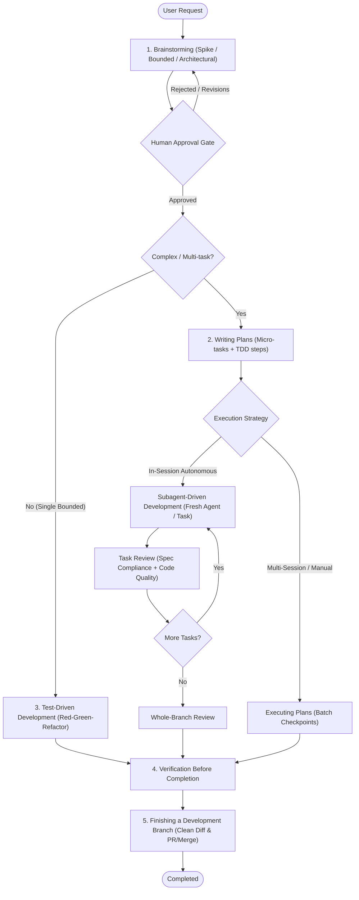

# Superpowers Cheat Sheet

A comprehensive, field-tested reference guide for engineering with the **Superpowers** agentic framework and methodology.

---

## 1. The Core Philosophy & Iron Laws

Superpowers transforms AI coding agents from reactive "code sprayers" into disciplined senior engineers who plan carefully, test rigorously, and execute autonomously.

> [!IMPORTANT]
> ### 🛡️ The 4 Non-Negotiable Iron Laws
> 1. **Skill Check Before Action**: Never touch code, run exploratory tools, or ask clarifying questions before checking and announcing relevant skills.
> 2. **TDD Iron Law**: `NO PRODUCTION CODE WITHOUT A FAILING TEST FIRST`. If you wrote code before the test, delete it and start fresh from tests.
> 3. **Debugging Iron Law**: `NO FIXES WITHOUT ROOT CAUSE INVESTIGATION FIRST`. Symptom patches without root-cause tracing are failure.
> 4. **Hard Approval Gate**: Never write implementation code or scaffold projects until the human partner reviews and approves the design.

---

## 2. Full Engineering Lifecycle Workflow



---

## 3. Skill Catalog (All 14 Skills)

| Skill | Primary Trigger | Core Focus & Output |
| :--- | :--- | :--- |
| **`using-superpowers`** | Start of every task/session | Meta-skill: Enforces discipline, finds skills, prevents rationalization. |
| **`brainstorming`** | Any new feature, behavior change, or spike | Socratic design refinement across 3 paths (Spike, Bounded, Architectural). |
| **`writing-plans`** | Approved design ready for multi-step execution | Detailed technical plan with explicit RED/GREEN TDD steps and verification commands. |
| **`executing-plans`** | Structured plan execution across sessions | Checkpoint-driven execution with human review at designated boundaries. |
| **`subagent-driven-development`** | Autonomous multi-task plan execution in session | Fresh implementer subagent per task + immediate 2-stage code/spec review. |
| **`test-driven-development`** | Any feature, fix, or refactor | Red (failing test) $\to$ Green (minimal code) $\to$ Refactor (clean up). |
| **`systematic-debugging`** | Any bug, test failure, or unexpected behavior | 4-phase root cause discovery before proposing or touching fixes. |
| **`verification-before-completion`** | Before claiming work is done or fixed | Evidence-first validation: run test commands and verify output assertions. |
| **`finishing-a-development-branch`** | Work complete, verified green | Merge/PR readiness: verify clean git diff, worktree cleanup, and branch handoff. |
| **`requesting-code-review`** | Major task milestone or pre-merge | Dispatches reviewer subagent targeting spec compliance, regressions, and quality. |
| **`receiving-code-review`** | Reviewer feedback received | Rigorous evaluation of feedback without performative agreement or blind changes. |
| **`using-git-worktrees`** | Starting tasks needing isolation | Isolated workspace branches preserving main repo stability. |
| **`dispatching-parallel-agents`** | $2+$ independent, non-overlapping tasks | Parallel subagent execution with isolated worktrees and structured ledger. |
| **`writing-skills`** | Creating or updating skills | Methodology for authoring, testing, and maintaining skills with test fixtures. |

---

## 4. Phase-by-Phase Playbooks

### A. Brainstorming: 3 Paths
Before asking questions, state the classified path out loud:
- **Spike**: Feasibility test ("can we do X?"). 2–3 sentence proposal $\to$ quick cheap experiment $\to$ report findings. Code is throwaway.
- **Bounded**: Modifying an existing, readable flow (one flag, small endpoint, one file). In-chat questions $\to$ short 2-paragraph design $\to$ **Human approval gate** $\to$ implement.
- **Architectural**: New subsystem, major refactor, cross-component change. Full requirements dialogue $\to$ written spec document $\to$ user approval $\to$ transition to `writing-plans`.

### B. Writing Plans: Plan Anatomy
Every plan must contain:
1. **Context & Goal**: Problem statement and user requirements.
2. **File Level Changes**: Marked clearly with `[NEW]`, `[MODIFY]`, or `[DELETE]`.
3. **Discrete Micro-tasks**:
   - Task 1: Write failing unit test (RED). Expected failure command & message.
   - Task 2: Implement minimal production code to pass test (GREEN).
   - Task 3: Refactor / verify full suite.
4. **Verification Commands**: Exact CLI commands to validate success.

### C. Test-Driven Development (TDD)
```
🔴 RED     → Write minimal test exercising the desired behavior.
            RUN TEST. Confirm failure with the expected error.
🟢 GREEN   → Write the minimal production code necessary to pass.
            RUN TEST. Confirm test passes and no existing tests break.
🔵 REFACTOR → Clean up duplicates, improve structure without changing behavior.
            RUN TEST. Ensure all green.
```

### D. Systematic Debugging: 4 Phases
1. **Phase 1: Root Cause Investigation**
   - Read full stack traces, line numbers, and exact error text.
   - Reproduce reliably with minimal test case.
   - Trace backwards from point of failure to invalid input or bad state.
2. **Phase 2: Pattern Analysis**
   - Has this worked before? What changed in git history recently?
   - Is this component violating an invariant?
3. **Phase 3: Hypothesis & Verification**
   - Formulate single hypothesis.
   - Add minimal diagnostic logging or test probe.
4. **Phase 4: Implementation**
   - Write failing test for the root cause $\to$ apply minimal fix $\to$ verify green.

---

## 5. Antigravity Tool & Action Mappings

When Superpowers skills describe high-level agent actions, map them to Antigravity's native primitives:

| Superpowers Action | Antigravity Native Primitive | Implementation Pattern |
| :--- | :--- | :--- |
| **Dispatch Subagent** (General) | `invoke_subagent` | `TypeName: "self"` (full read/write/bash execution) |
| **Dispatch Reviewer / Researcher** | `invoke_subagent` | `TypeName: "research"` (read-only exploration) |
| **Task / Todo Tracking** | Task Artifact | Save checklist via `write_to_file` (`IsArtifact: true`, `ArtifactMetadata.ArtifactType: "task"`), update with `replace_file_content`. *(Note: `manage_task` is for background processes, not checklists)* |
| **Read File** | `view_file` | Precise lines (`StartLine`, `EndLine`) or full content. |
| **Edit File** | `replace_file_content` | Exact character matching replacement chunks. |
| **Run Shell / Tests** | `run_command` | Execute tests, build scripts, or git commands. |
| **Ask Clarification** | `ask_question` / Markdown | Multi-choice interactive modal or direct markdown prompt. |
| **Manage Plugin** | `agy plugin [subcmd]` | `agy plugin list`, `install`, `enable`, `disable` |

---

## 6. Red Flags & Rationalization Breakers

Whenever you catch yourself thinking any of these, **STOP immediately** — you are rationalizing avoiding process:

| ❌ Rationalizing Thought |  Real-World Reality |
| :--- | :--- |
| *"This is just a simple question / trivial tweak"* | Simple tasks are where unexamined assumptions cause the biggest regressions. |
| *"Let me look at the code before choosing a skill"* | Skills define *how* you look at the code. Check skills first. |
| *"I'll write tests after the feature works"* | Tests written after code test what you wrote, not what was required. Red-Green is mandatory. |
| *"I already know what the bug is"* | Guessing fixes causes thrashing. Complete Phase 1 root cause investigation first. |
| *"The user is in a hurry, so I'll skip the plan"* | Skipping the plan guarantees rework, bugs, and longer delays. |
| *"I'll keep the uncommitted scratch code as reference"* | Delete it. If it was written before a failing test, it's poison. Start fresh from the test. |

---

## 7. Quick Terminal Cheatsheet (`agy`)

```bash
# Plugin Management
agy plugin list                                      # List installed plugins & state
agy plugin install https://github.com/obra/superpowers # Install / update superpowers
agy plugin enable superpowers                        # Enable plugin
agy plugin disable superpowers                       # Disable plugin

# Verification Suite (DirtyNest Project)
npm run typecheck                                    # TypeScript check (0 errors)
npm test                                             # Vitest test suite
npm run lint                                         # ESLint (0 errors / warnings)
```
